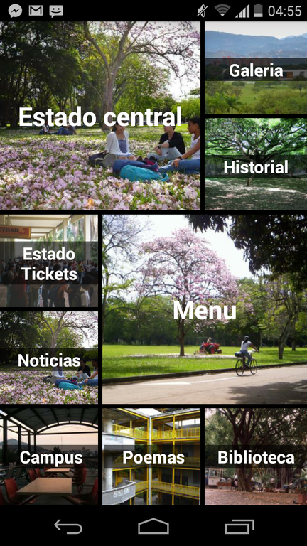
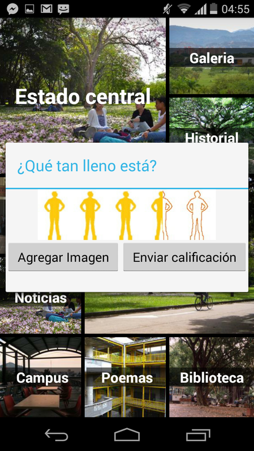

Centralapp
--------------
CentralApp es una aplicación comunitaria tipo portal para android que expone distintos servicios de la Universidad del Valle.

## Bugs
Es probable que encuentres errores durante la ejecución de la aplicación. Escribenos detallando el incoveniente para arreglarlo lo
mas pronto posible.

Capturas
--------------



## Servicios
- Estado de central
- Fotos sobre la congestión en la cafeteria central
- Historial sobre la congestión de la cafeteria central
- Menú del día
- Menú de la semana
- Historial de menus
- Noticias
- Historial sobre la congestión para la compra de tickets
- Notificaciones perezosas sobre el campus virtual
- Consultas sobre deudas en la biblioteca
- Consultas sobre libros prestados en la biblioteca
- Lectura y publicación de poemas
- Juegos de georeferenciación
- Mapa de la universidad
- Realidad aumentada sobre el campus Melendez

## Proximamente
- Información sobre la universidad
- Eventos de las mismas
- App para IOS, WP y Web.

## Uso (para clientes)
Descarga el .apk desde playStore o desde aquí[] e instalalo en tu dispositivo android

## Uso (para desarrolladores)
Descarga el proyecto y abrelo con android studio

```
$ git clone ...
```
## Requisitos
- Dispositivo android (puede ser un emulador) con Android +2.2

## Nota
Si perteneces a otra sede u otra universidad escribenos.

## Advertencia
- Esta aplicación no compromete a la Universidad del Valle, fue creada por terceros con la motivación de que varios de sus servicios
fuesen expuestos al público a través de nuevas tecnologías.

## Con ❤ desde el lab de redes